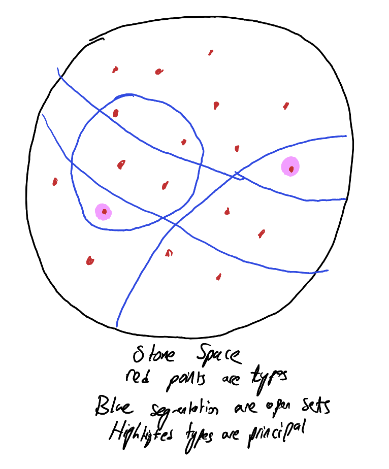

Often times, logic can feel unintuitive and very syntactical, especially if you don't spend a lot of time working with the ideas. This semester I've been doing a directed reading program in model theory, and I've found that model theory is actually the opposite! There are some very rich and intuitive concepts present in model theory, that I will try to describe here. My goal by the end of this blog post is to paint a picture of what exactly a model is, and what it means for a model to be atomic or saturated. It should be noted that the intended audience for this post is people who have some experience with propositional and first order logic. This is likely you if you have taken your school's computer science discrete math class or intro to proofs class (or if you do any proof based math at all). Also, I am still learning this stuff, and this post is to help me understand it better, so if there is any incorrect concepts, please let me know!

## Motivation
Often times I find the motivation behind many mathematical structures unmotivated, so here I will try to first motivate what a model is, using some anologies.

#### Syntax versus Semantics
The difference between syntax and semantics is a pervasive idea that shows up in everywhere from linguistics to theoretical CS. The best way to explain it is using natural language. In English, we have a grammar that describes *how* we should form sentences. It doesn't tell us much about what that sentence *means* though. To demonstrate this, we can construct a sentence that is syntactically correct, but semantically meaningless. The canonical example in linguistics is "Colorless green ideas sleep furiously". It is clearly grammatically correct, but it is not semantically meaningful, which seperates the notions. Another example, for programmers, is in Python there is a *way* to form valid programs (i.e. ones that parse), but this doesn't say anything about what the program actually *does*.

#### Propositional Logic
Let's first remember our propositional logic basics. As a very rough review, propositional logic is the logic where we have a set of variables, and then we have the logical connectors $\wedge, \vee, \to, \neg$. Some example sentences in propositional logic are

- $\varphi \wedge \psi$
- $(\varphi \to \psi) \to (\neg\varphi\vee\psi)$
- $((\neg(\varphi\wedge\psi)) \to ((\neg\varphi)\vee(\neg\psi))) \wedge ((\neg\varphi)\vee(\neg\psi)))\to ((\neg(\varphi\wedge\psi))$

We want to be able to reason about these sentences. What does it mean for a sentence to be a tautology? What about what does it mean for one sentence to **entail** another? These questions can be answered in two ways: syntactically, and semantically.

Syntax wise, this introduces the proof system we have all worked with. We have inference rules like modus ponens, proof by contradiction, disjunctive syllogism, etc. They tell us how to manipulate sentences to prove things. It is purely a syntax driven exercise: we don't have to have any understanding of the meaning of these sentences to push them around. If we can start with a set of sentences $\Sigma$, and prove some sentence $\varphi$, we write $\Sigma\vdash\varphi$. We say that a sentence $\varphi$ is **consistent** if there is no sentence $\psi$ in our language where $\{\varphi\}\vdash (\psi\wedge(\neg\psi))$.

Semantic wise, we use **valuations**: _total_ functions from the set of variables in our language to the set $\{T, F\}$. Given a valuation, $f$, we define a **model**, $v$, as a _total_ function from the set of all possible sentences to the set $\{T, F\}$. Before defining a model, I present some vocab. We then say a sentence(or a set of sentences) **has a model/is satisfiable** if and only if there exists a model where $v(\varphi) = T$ (or for a set of sentences, that $v$ makes every sentence true). We also say that given a set of sentences, $\Sigma$, it **models/satisfies** a sentence $\varphi$ if and only if for all models that satisfy $\Sigma$, they also satisfy $\varphi$. This is written as $\Sigma\models\varphi$. Finally, the obvious way to define models is as follows:

1. For $c$ a variable, we define $v(c) = f(c)$
2. $v(\varphi\wedge\psi) = T$ if and only if $v(\varphi) = T$ and $v(\psi) = T$
3. $v(\varphi\vee\psi) = F$ if and only if $v(\varphi) = F$
4. $v(\neg\varphi) = T$ if and only if $v(\varphi) = F$
5. $v(\varphi\to\psi) = v((\neg\varphi)\vee\psi)$

The natural first question to ask is, do these notions coincide? Is our syntax based transformations as strong (but not stronger!) than our semantic models? Thanks to the logicians of the past, we know that this is true. To put it formally, we say that a sentence is consistent if and only if it has a model. We can also use this notion to talk about sets of sentences. We say that a set of sentences, $\Sigma$, is consistent if and only if it is satisfiable. Finally, we know that $\Sigma\models\varphi$ if and only if $\Sigma\vdash\varphi$. This theorem is called the **soundness and completeness** theorem. I will not go into the proofs of these statements, but it is sufficient to internalize the idea that in our vanilla propositional logic, syntax crunching is the same notion as semantics.

#### First Order Logic
Now moving onto first order logic, we have a significant increase in degree of complexity. To review, for formulas in first order logic are "parameterized" by a language. What this means is that we fix a **language**, $\mathscr{L}$, which is a set of constant symbols, $c_1, c_2, \ldots$, a set of function symbols (each with an attatched arity) $F_1, F_2, \ldots$, and a set of relation symbols (also with an attatched arity) $R_1, R_2, \ldots$. We can then write formulas in our language. Something that should be noted is that $F_i(c_1,\ldots, c_n)$ shouldn't be denoted as a formula! It doesn't say anything. We call these types of expressions as **terms**. More formally, terms are just constants, function applications to terms, or variables. It should also be noted that in first order logic, formulas can have *free variables*, which are just variables that aren't introduced using a quantifier. We write $\varphi(x_1,\ldots, x_n)$ to signify that the free variables of $\varphi$ are within $\{x_1,\ldots, x_n\}$ (it doesn't have to use all of them). Here are some examples of first order formulas.

- $\varphi(x_1, x_2) = (F_1(x_1) \equiv F_2(x_2)) \wedge (F_1(x_2)\equiv F_2(x_1))$
- $\varphi(x_1) = \forall x. R_1(x)$
- $\varphi(x_1, x_2, x_3) = R_2(x_1, x_2, x_3)$

We call a formula with no free variables a sentence.

Much like with propositional logic, I won't go into the actual inference rules of our system, as I am assuming you are already familiar with these. I instead will go straight into defining models. We want a way to reason about our formulas in a semantic way much in the same way we reason about propositional calculus. We need some "environment" where we assign things values (like valuations did). We define this as a model. A *model*, $\mathfrak{A}$, of a language, $\mathscr{L}$, is a non-empty set $A$, called the universe, equipped with

- An element $b_i\in A$ corresponding to every constant $c_i\in\mathscr{L}$
- A n-ary function $f_i : A^n \to A$ for every n-ary function symbol $F_i\in\mathscr{L}$
- A n-ary relation on $A$, $Q_i\subseteq A^n$ for every n-ary relation symbol $R_i\in\mathscr{L}$

Rather than go through the super dry and boring definition of what it means for a model to satisfy a formula, I would like to rather describe what it _should_ mean, and go from there. First off, models have to fulfill formulas, which may have free variables. So, we should have some extra information: we say a model satisfies a formula $\varphi(x_1,\ldots, x_n)$ at a tuple $(a_1,\ldots, a_n)$. Next, we should realize that terms should represent elements of $A$, and the formulas that are operations on terms ($\equiv$ or relations) should be just checking if the property holds for the value in $A$ the term represents. To clear up this notion, let us take the example $\varphi(x_1) = F_1(c_1) \equiv F_1(c_2, x_1)$. We say that a model satisfies $\varphi(x_1)$ at $a\in A$ if and only if $f_1(b_1) = f_2(b_2, a)$ in $A$. Similarly, for terms, we say that our model satisfies the formula $\varphi(x_1, x_2) = R_1(x_1, c_1, x_2, c_2, c_3)$ on $(a_1, a_2)$ if and only if $Q_1(a_1, b_1, a_2, b_2, b_3)$ is true in $A$. Ok, so now, what should it mean for a model to satisfy the formula $\forall x. \varphi$ on $(a_1,\ldots, a_n)$. Well, it should mean that $\varphi$ is satisfied on $(a_1,\ldots, a_n)$ as normal, but whenever $x$ appears free in $\varphi$, we should be able to plug in any $a\in A$, and our model should satisfy it. Similarly, for $\exists x. \varphi$, it means that there exists some $a\in A$ that can be plugged into every free occurrence of $x$, and our model would satisfy it. Notice that for sentences, we don't need to write "on" anything, we can just say $\mathfrak{A}\models \varphi$. Again, the syntax and semantics of first order logic have the same power. So, a sentence is consistent if and only if it has a model. Now that we have defined a model and how models and formulas interact, we can step back and realize that the world of models is _very_ rich and large. To study models of a language, we traditionally take a set of sentences, $T$, called a **theory**. We then study models of that theory (i.e. models that satisfy every sencence in $T$). We say a theory $T$ is complete if for every sentence $\varphi$, either $T\vdash\varphi$ or $T\vdash\neg\varphi$.

#### An example
The theory of a simple order, in the language with one 2-place relation ($\leq$), is as follows (presentation from Chang and Keisler)

1. $\forall x. \forall y. \forall z. (x\leq y \wedge y\leq z \to x \leq z)$
2. $\forall x. \forall y. (x\leq y\wedge y\leq x \to x\equiv y)$
3. $\forall x. x \leq x$
4. $\forall x. \forall y. (x\leq y \vee y\leq x)$

These sentences are also known as transitivity, antisymmetry, reflexivity, and comparability. We will call this theory $S$ from now on. An example of a model of this theory would be $\langle\mathbb{N}, \leq\rangle$ where $\leq$ here is the natural less than equal to realtion on the natural numbers.

### Types
Let us say we have two different models $\mathfrak{A}, \mathfrak{B}$ in our language $\mathscr{L}$. They can be very different structures! From our previous example, take the model $\mathfrak{A} = \langle\mathbb{N}, \leq\rangle$ of our simple linear order from before. Also, take the model $\mathfrak{B} = \langle\mathbb{Z}, \leq\rangle$. These two models both satisfy our theory, $S$. But, there is something very different about $\mathfrak{A}$ and $\mathfrak{B}$. While $\mathfrak{A}$ has a least element, $\mathfrak{B}$ does not! For another example, look to the language with no relations symbols, two function symbols $+, *$, and two constants $0, 1$. We can take two models of this language, $\mathfrak{Q} = \langle \mathbb{Q}, +, *, 0, 1\rangle$ and $\mathfrak{R} = \langle \mathbb{R}, +, *, 0, 1\rangle$. Notice that $\mathfrak{Q}$ is missing some elements that $\mathfrak{R}$ has: for example there is no element that satisfies the formula $x*x\equiv 1 + 1$ in $\mathfrak{Q}$, but there is one in $\mathfrak{R}$. We want to be able to talk about the absence or presence of these objects in models, and so we will first formalize exactly _what_ is the difference between these models. A **type** is a set $\Gamma(x)$ of formulas with $x$ free. $\Gamma(x)$ has to fulfills some specific properties for it to be a type, described below

1. $\Gamma(x)$ should be consistent
2. $\Gamma(x)$ should be maximal

The word maximal is new here. We say a set of formulas, $\Gamma(x)$ is **maximal** if and only if for every formula $\varphi(x)$, either $\varphi(x)\in\Gamma(x)$ or $\neg\varphi(x)\in\Gamma(x)$. Basically, if a set of formulas is maximal, that means it has made up its mind on what it wants any models to believe. There is nothing left to the imagination. Given some type $\Gamma(x)$, we say a model **realizes** it if there is some $a\in A$ such that for every formula $\phi(x)\in\Gamma(x)$, our model satisfies $\phi(x)$ on $a$. We say a model **omits** a type if it does not realize it. So, an example of a type in $S$ is the set of all formulas, $\varphi(x)$, that $\mathfrak{A}$ makes true about $0$. This is obviously consistent (because the set has a model by definition) and is maximal (we take everything that holds true, so if something does not hold true, we add its negation). It is clear that $\mathfrak{A}$ realizes our type, while $\mathfrak{B}$ omits it, as some formula that looks like $\forall y. x\leq y$ is in our type, and $\mathfrak{B}$ doesn't have a least element. We want to be able to classify how rich or barebones a model is. Does it realize _any_ type that it possibly could realize? Or does it realize only the types it _has_ to realize? This brings in the two topics that this blog post is mainly about.

### Atomic Models
Atomic models are the models that are bare bones. I will first provide the formal definition, then explore it through a topological space as a means for understanding it better. Fix some model $\mathfrak{A}$ of a complete theory $T$. We say that a formula, $\varphi(x)$, is **complete with respect to** $T$ if and only if for all $\psi(x)$ in our language, _exactly_ one of the following hold

- $T\models \varphi\to\psi$
- $T\models \varphi\to\neg\psi$

where a theory models a formula if for every model of the theory, every element $a\in A$ satisfies the formula. We then say that $\mathfrak{A}$ is **atomic** if and only if for all $a\in A$, there is some formula $\varphi(x)$ that is complete with respect to $T$ that $a$ realizes.

Ok that was dense. At surface level, one might think how does this even have anything to do with types, let alone communicate that a model is barebones? Let us create a space in which to explore what that definition means. Take the set $S$ to be the set of all types $\Gamma(x)$ that are consistent with $T$ (i.e. $T\cup\Gamma(x)$ is satisfiable). We then define the topology using a basis. For every formula $\varphi(x)$ in our language, we let $\{\Gamma(x) : \varphi(x)\in\Gamma(x)\}$ be a basic set. Notice that this fulfills the topology rules of a topology, since we can use $\varphi(x)\wedge\neg\varphi(x)$ to get the empty set, and $\varphi(x)\vee\neg\varphi(x)$ to get all types (since types are maximally consistent). For some context, this space is a **stone space** (not important, I won't talk about that here). We want to investigate the types that are isolated points in this space. A type, $\Gamma(x)$, is an isolated point if and only if $\{\Gamma(x)\}$ is open in our space. Well, notice that this is true if and only if there is some formula $\varphi(x)\in\Gamma(x)$ such that it is not in _any_ other type (since every open set is the arbitrary union of basic sets). We know that this formula $\varphi(x)$ is complete with respect to $T$. This is because $\varphi(x)$ logically "carries" all the information in $\Gamma(x)$, which is maximal and complete! We also know that $\varphi(x)$ is consistent with $T$, so some model satisfies $\varphi(x)$, meaning that only _exactly_ one of the two conditions for a formula to be complete holds. These types that can be represented by a single formula are called **principal types**.

Ok, so we know that atomic models _only_ realize principal types. How does this make them barebones? Well, take the sentence $\psi = \exists x.\varphi(x)$. We know that $T$ is complete, which means that either $T\vdash\psi$ or $T\vdash\neg\psi$. By soundness and completeness, we know that this is the same thing as saying $T\models\psi$ or $T\models\neg\psi$. We know that $T\nvDash\neg\psi$ because $\varphi(x)$ is consistent with $T$, so some model of $T$ exists where $\varphi(x)$ is realized. As such, $T\models\psi$, meaning every model of $T$ satisfies this type! By the definition of atomic, though, atomic models _only_ satisfy these types. They only only satisfy the required, mandatory types that _every_ model of $T$ satisfies! The "barebones" descriptor really makes sense now, doesn't it.

### Saturated models
Ok, so now that we talked about the minimalist models, we should talk about the maximalist models. These models contain _everything_ they can possibly contain. Let's try to workshop a definition for what this should represent. Fix some model $\mathfrak{A}$ of a complete theory $T$. The first guess would probably be something like, "the model $\mathfrak{A}$ should realize every type $\Gamma(x)$ that is consistent with $T$". If you know any algebra, you probably can spot one reason why this notion could be strengthed though! Not all elements $a\in A$ can be pinned down by just logical formulas. For example, the number $e$ or $\pi$ are not the solution to any polynomial (i.e. transcendental numbers cannot be expressed in the theory of fields). But, if we still want our model to be as rich as possible, it should be able to make create types that use these elements! To do this, we use a very common trick in model theory, that of expanding a model and a language. For any finite subset $Y\subseteq A$, we can expand our model $\mathfrak{A}$ to $(\mathfrak{A}, a)_Y$ in the language $\mathscr{L}_a$ as follows. Let $\mathscr{L}_a = \mathscr{L}\cup \{c_a : a\in Y\}$ (the language $\mathscr{L}$ but we add a new fresh constant for every element $a\in Y$). For $(\mathfrak{A}, a)_Y$, we keep the model $\mathfrak{A}$ but just interpret every $c_a$ as $a$. Now, we can effectively talk about the elements of $A$ in this language! Let $\Delta_Y$ be the set of all sentences true in an expanded model $(\mathfrak{A}, a)_Y$. We say that a model $\mathfrak{A}$ is **saturated** if and only if for every finite subset $Y\subseteq A$, every type $\Gamma(x)$ in $\mathscr{L}_Y$ consistent with $\Delta_Y$ is realized in $(\mathfrak{A}, a)_Y$. Intuitively what this is saying is, give me any type $\Gamma(x)$ (a list of requirements that we want our object to obey) that uses finitely many elements from our universe $A$ in a way that actually "makes sense" (it has to be consistent with $\Delta_Y$), and I will find an element in $A$ that realizes it. This communicates a "fullness" on a much higher scale than the previous definition we tried out. Now, for a model to be saturated, it has to contain types that even talk about elements in our universe that are not representable. This idea of extending a model and a language to include elements from our universe is a very common idea in model theory.

### Examples
Ok, time for an example! It is actually the case that _every_ complete theory has an atomic model and a saturated model. The following example is thanks to Andrzej Ehrenfeucht. Take the theory and language for a simple order, and add countably infinite many constant symbols. We then also add the following axioms to the theory of simple linear order, $T$

- $\forall x. \forall y ((x\leq y \wedge x\nequiv y) \to (\exists z. (x \leq z \wedge x\nequiv z\wedge z\leq y\wedge z\nequiv y)))$
- $\exists x.\exists y. (x\nequiv y)$
- $\forall x. \exists y. (y\leq x \wedge y\nequiv x)$
- $\forall x. \exists y. (x\leq y \wedge y\nequiv x)$
- $c_i \leq c_{i+1}$

The first axiom adds density, the second axiom ensures there is more than one element, and the third and fourth axioms ensure there is no endpoints (i.e. no highest or lowest number). The fifth axiom is not actually an axiom, but rather an axiom schema. It is just telling us that we append the set $\{c_i \leq c_{i+1} : i\in \mathbb{N}\}$ to the theory. Take two different models

- $\mathfrak{A} = \langle \mathbb{Q}, (a_i)_{i\in\mathbb{N}}, \leq$
- $\mathfrak{B} = \langle \mathbb{Q}, (b_i)_{i\in\mathbb{N}}, \leq$

where we define $a_i = i$ and $b_i = \Sigma_{k = 0}^i \frac{1}{k!}$. Notice that $a_i$ tends towards infinity while $b_i$ tends towards $e$. We will show that $\mathfrak{A}$ is atomic but not saturated, and $\mathfrak{B}$ is saturated but not atomic.

#### $\mathfrak{A}$
To see that $\mathfrak{A}$ is atomic, take any element $a\in \mathbb{Q}$. There are three cases. Assume $a = c_k$ for some $k$. Then, the formula $x \equiv c_k$ actually represents a principal type. This is because if $a = c_k$, then there is no way there can be two different maximally consistent sets from this fact. Next, if $a \leq c_0$, it is the case that $x \leq c_0$ represents a principal type. The way to intuitively think about this is that the elements below $c_0$ are indistinguishable. There is no formula that you can write that holds for some $b \leq c_0$ that doesn't hold for $a$. Similarly, if $a \geq c_0$, then we know that there are is some $k$ such that $c_k \leq a \leq c_{k+1}$. The formula $c_k \leq x \leq c_{k+1}$ also represents a principal type for the same reason as the last case. So, every element satisfies some principal type, meaning the model is atomic. The model is not saturated, though, as we can create a type for the "top" element that is not a principal type. Take $Y$ to be the empty set (we don't need to talk about any elements in $\mathfrak{A}$ to show it is not saturated), and take the set $\Gamma(x) = \{x \geq c_i : i\in\mathbb{N}\}$. $\Gamma(x)$ is consistent with $T$ (using an appeal to the compactness theorem, which I have not outlined here so you will have to take my word for it). But obviously, $\Gamma(x)$ is not a principal type. Since our model is atomic, then, there is no rational number satisfying this model

#### $\mathfrak{B}$
Notice that this model is not atomic. To see this, take some rational number $a > e$. Then, the only formulas that $a$ realizes are of the form $x \geq c_k$ for some $k$ (or more complex formulas than this that are just conjunctions/disjunctions/negations of phrases like this). This formula isn't complete though! Notice that $x \geq c_k$ doesn't specify wether $x \leq c_{k+1}$ or $\neg(x\leq c_{k+1})$. So, we are done. This model is saturated though! The reason for this is that since our sequence converges to an irrational number, there is no way to "tear" apart the elements above the sequence and the elements below. Imagine our sequence converged to a rational $q$ instead. Then, we could easily describe an element above all constants but below $q$. But, because of the fact we cannot talk about $e$ and the density of $\mathbb{Q}$ in $\mathbb{R}$, there is no way to talk about the "top" of the sequence without having some element come after.

### Conclusion
If that was messy I apologize, I didn't really proof read this as it was more just a demo of this website (which I really like, it makes writing math on the web so easy). To recap, we have complete theories. These theories pin down everything that should be true and everything that should be false. We call two models elementarily equivalent if they make exactly the same formulas true, and models of complete theories are exactly that. But, there are still differences in models that are elementarily equivalent! They lie in the structure of the model, and how it satisfies types: does the model only have the mandated types required by the theory, or is the structure much richer and we have an element that captures every type. It should be noted that this presentation is a simplified version. In model theory, atomicity is not just for types over one variable, but instead for types over any finite amount of variables. Similarly, the notion of saturation presented here is what is called $\omega$-saturation. There are stronger saturation conditions for other ordinals. Finally, if someone reads this and has any questions, finds something wrong, or has any suggestions, please comment. It seems that the ability of a comment section is a really good feature of this site. Oh, and also everything I've learned has been thanks to the textbook _Model Theory_ by Chang and Keisler and my DRP mentor.
Thanks for reading my post!
